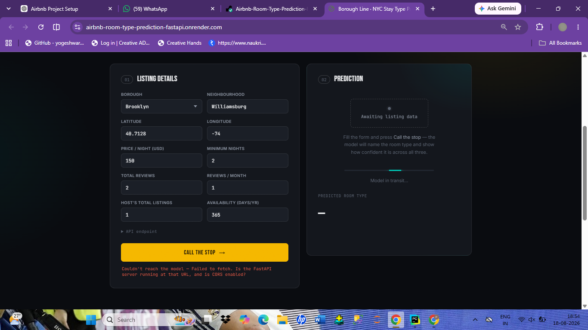
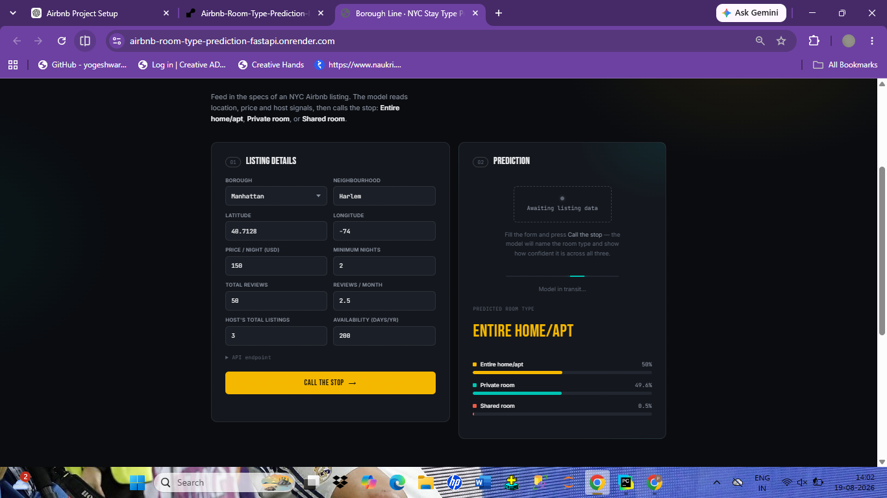

# 🏠 Airbnb Room Type Prediction

Machine Learning + FastAPI + HTML/CSS/JavaScript + Render
<p>
<a href="https://airbnb-room-type-prediction-fastapi.onrender.com"><strong>🚀 Live Demo</strong> </a>   •   <a href="https://github.com/PavanIllal/Airbnb-Room-Type-Prediction-FastAPI"> <strong>💻 GitHub Repository</strong> </a>   •   <a href="https://airbnb-room-type-prediction-fastapi.onrender.com/docs"> <strong>⚡ API Documentation</strong> </a>

</p>
<p>
    

</p>


------------------------------------------------------------------------

## 🏠 Project Overview

**Airbnb Room Type Prediction** is a machine learning web application
that predicts the room type of an NYC Airbnb listing from listing
details such as location, price, minimum nights, reviews, host listing
count, and availability.

The trained machine learning pipeline is served through a **FastAPI REST
API**, while a responsive **HTML/CSS/JavaScript frontend** provides an
interactive interface for users. The complete application is deployed on
**Render**, making it accessible through a public URL.

### 🎯 Prediction Classes

The model predicts one of three room types:

-   🏠 **Entire home/apt**
-   🛏️ **Private room**
-   🚪 **Shared room**

------------------------------------------------------------------------

## ✨ Features

-   🤖 Machine learning-based room type prediction
-   📊 Probability scores for all three room types
-   🌐 Interactive web interface
-   ⚡ FastAPI REST API
-   ✅ Input validation using Pydantic
-   🔐 CORS support for frontend/API communication
-   📚 Interactive Swagger API documentation
-   💾 Pre-trained Scikit-learn pipeline
-   🚀 Cloud deployment using Render
-   📦 Git LFS support for the large `.pkl` model file

------------------------------------------------------------------------

## 🛠️ Tech Stack

  Category               Technology
  ---------------------- ---------------------------------
  Programming Language   Python
  Data Processing        Pandas
  Machine Learning       Scikit-learn
  Model                  Random Forest Classifier
  API                    FastAPI
  Validation             Pydantic
  Model Serialization    Joblib
  Frontend               HTML, CSS, JavaScript
  Visualization          JavaScript/CSS probability bars
  Version Control        Git & GitHub
  Large File Storage     Git LFS
  Deployment             Render

------------------------------------------------------------------------

## 📊 Dataset

The project uses an **NYC Airbnb listings dataset** containing
information about Airbnb properties in New York City.

The model uses selected listing, location, host, review, and
availability features to predict the room type.

------------------------------------------------------------------------

## 🤖 Machine Learning

### Model Pipeline

The project uses a Scikit-learn preprocessing and classification
pipeline.

The workflow includes:

1.  Data cleaning and preparation
2.  Feature selection
3.  Numerical feature preprocessing
4.  Categorical feature encoding using OneHotEncoder
5.  Random Forest classification
6.  Model evaluation
7.  Saving the trained pipeline using Joblib
8.  Loading the pipeline in FastAPI for predictions

The saved model is:

``` text
Model_Pipeline.pkl
```

Because the model file is large, **Git LFS** is used to store it in the
GitHub repository.

------------------------------------------------------------------------

## 🔄 Project Workflow

``` text
NYC Airbnb Dataset
        │
        ▼
Data Cleaning & Preprocessing
        │
        ▼
Feature Engineering / Selection
        │
        ▼
ColumnTransformer
(Numerical + Categorical Processing)
        │
        ▼
Random Forest Classifier
        │
        ▼
Model Evaluation
        │
        ▼
Model_Pipeline.pkl
        │
        ▼
FastAPI REST API
        │
        ▼
HTML + CSS + JavaScript Frontend
        │
        ▼
Render Deployment
        │
        ▼
Public Web Application
```

------------------------------------------------------------------------

## 📥 Input Features

The application accepts the following features:

  -----------------------------------------------------------------------
  Feature                             Description
  ----------------------------------- -----------------------------------
  `latitude`                          Latitude coordinate of the listing

  `longitude`                         Longitude coordinate of the listing

  `price`                             Price per night

  `minimum_nights`                    Minimum number of nights required

  `number_of_reviews`                 Total number of reviews

  `reviews_per_month`                 Average reviews per month

  `calculated_host_listings_count`    Number of listings owned by the
                                      host

  `availability_365`                  Number of available days in a year

  `neighbourhood_group`               NYC borough

  `neighbourhood`                     Specific NYC neighbourhood
  -----------------------------------------------------------------------

------------------------------------------------------------------------

## 📤 Prediction Output

The API returns:

-   Predicted room type
-   Probability for each room type

Example:

``` json
{
  "Predicted_room_type": "Entire home/apt",
  "Probability": [
    0.50,
    0.496,
    0.005
  ]
}
```

> The displayed probabilities in the frontend are rounded to one decimal
> place, so their displayed total may occasionally be slightly above or
> below 100%.

------------------------------------------------------------------------

## Application Screenshots

### Live Application

<p align="center">
  
</p>

### Prediction Result

<p align="center">
  
</p>

------------------------------------------------------------------------

## 🚀 Live Demo

Try the deployed application:

### 👉 [Airbnb Room Type Prediction --- Live Demo](https://airbnb-room-type-prediction-fastapi.onrender.com)

The application is publicly accessible and can be opened from a desktop
or mobile browser.

------------------------------------------------------------------------

## ⚡ API Documentation

FastAPI automatically provides interactive API documentation using
Swagger UI.

### Swagger UI

👉 [Open API
Documentation](https://airbnb-room-type-prediction-fastapi.onrender.com/docs)

### Endpoint

``` text
POST /predict
```

------------------------------------------------------------------------

## 🧪 Example API Request

### Request

``` json
{
  "latitude": 40.7128,
  "longitude": -74.0060,
  "price": 150,
  "minimum_nights": 2,
  "number_of_reviews": 50,
  "reviews_per_month": 2.5,
  "calculated_host_listings_count": 3,
  "availability_365": 200,
  "neighbourhood_group": "Manhattan",
  "neighbourhood": "Harlem"
}
```

### Response

``` json
{
  "Predicted_room_type": "Entire home/apt",
  "Probability": [
    0.50,
    0.496,
    0.005
  ]
}
```

The exact probabilities and prediction may vary depending on the input
values.

------------------------------------------------------------------------

## 📈 Model Performance

The trained model achieved:

  Metric                Score
  -------------- ------------
  **Accuracy**     **85.45%**
  **F1 Score**     **73.43%**

``` text
Accuracy Score: 0.854486861675756
F1 Score:      0.7342896793260923
```

The F1 score is reported to provide a more informative view of
classification performance across the room-type classes.

------------------------------------------------------------------------

## 💻 Local Installation

### 1. Clone the repository

``` bash
git clone https://github.com/PavanIllal/Airbnb-Room-Type-Prediction-FastAPI.git
cd Airbnb-Room-Type-Prediction-FastAPI
```

### 2. Create a virtual environment

``` bash
python -m venv venv
```

### 3. Activate the environment

**Windows:**

``` powershell
venv\Scripts\activate
```

**Linux/macOS:**

``` bash
source venv/bin/activate
```

### 4. Install dependencies

``` bash
pip install -r requirements.txt
```

### 5. Run the FastAPI application

``` bash
uvicorn main:app --reload
```

### 6. Open the application

``` text
http://127.0.0.1:8000
```

### 7. Open Swagger documentation

``` text
http://127.0.0.1:8000/docs
```

------------------------------------------------------------------------

## 📁 Project Structure

``` text
Airbnb-Room-Type-Prediction-FastAPI/
│
├── static/
│   ├── index.html
│   ├── script.js
│   └── style.css
│
├── Model_Pipeline.pkl
├── main.py
├── requirements.txt
├── NYC_Airbnb_Room.ipynb
├── .gitattributes
├── .gitignore
└── README.md
```

> `Model_Pipeline.pkl` is tracked using Git LFS because of its large
> file size.

------------------------------------------------------------------------

## 🌐 Deployment

The application is deployed using **Render**.

### Deployment flow

``` text
GitHub Repository
       │
       ▼
Render
       │
       ▼
Install requirements
       │
       ▼
Start FastAPI with Uvicorn
       │
       ▼
Public HTTPS URL
```

### Production URL

``` text
https://airbnb-room-type-prediction-fastapi.onrender.com
```

------------------------------------------------------------------------

## 🔮 Future Improvements

-   Improve model performance through additional feature engineering
-   Experiment with advanced ensemble models
-   Add model monitoring
-   Add more detailed prediction explanations
-   Improve probability calibration
-   Add automated testing
-   Add CI/CD workflow using GitHub Actions
-   Improve responsive design for different screen sizes
-   Add additional Airbnb business insights and analytics

------------------------------------------------------------------------

## 👨‍💻 Author

### Pavan Illal

**Computer Science & Engineering \| Data Analytics \| Machine Learning
\| Python**

-   💻 GitHub: [PavanIllal](https://github.com/PavanIllal)
-   🚀 Live Project: [Airbnb Room Type
    Prediction](https://airbnb-room-type-prediction-fastapi.onrender.com)
-   📚 Repository:
    [Airbnb-Room-Type-Prediction-FastAPI](https://github.com/PavanIllal/Airbnb-Room-Type-Prediction-FastAPI)

------------------------------------------------------------------------


### ⭐ If you found this project interesting, consider giving the repository a star!

**Built with Python, Scikit-learn, FastAPI and JavaScript.**

